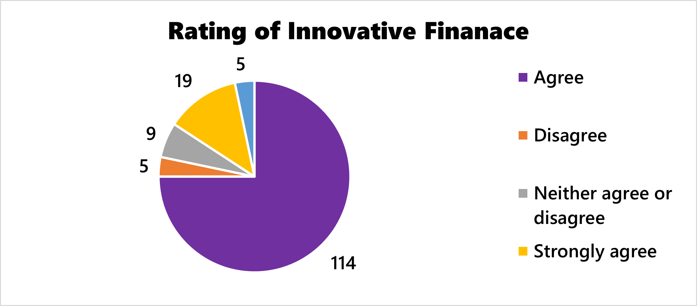

# Innovative Finance in Chemical Logistics Industry

---

## Introduction:
Corporate Social Responsibility (CSR) is a process where companies integrate social and environmental concerns into their business operations and interactions with stakeholders. More and more companies are investing in CSR-related management control systems to create value for both society and businesses while reducing environmental damage. Research has provided evidence that listed companies have greater access to funding opportunities for green projects, leading to higher levels of CSR-related management control components implemented and corresponding positive effects on company performance. 

However, Small and Medium-sized Enterprises (SMEs) are also expected to establish internal mechanisms that promote sustainable behavior, particularly in risky industries such as chemical logistics. SMEs may face greater pressure to adopt sustainable practices as they have the potential to cause more significant environmental damage and negative social impacts.

## About the Analysis:
For this analysis and to find answers to the research questions, a questionnaire was used to collect primary data from a cross-company design that included both Small and Medium-sized Enterprises (SMEs). The questionnaire comprised 10 questions and measures were taken to ensure the reliability of the data, including random sampling and extensive pre-testing with experts from a local economic development corporation and industry managers. The target population consisted of 1,228 SMEs in the industry, and a sample of 200 questionnaires was distributed to top-level managers during the period between November 1st and December 30th, 2022. A total of 152 completed questionnaires were returned and the responses were recorded in an MS Excel Spreadsheet.

## Research Questions:
1. What innovative finance mechanisms are available in the financial markets? 
2. What are the financial problems facing the chemical logistics industry?
3. What can chemical logistics companies do to achieve sustainable development?
4. What are possible solutions for innovative finance for chemical logistics business development and sustainability?

## My Approach:
For this analysis, an MS Excel spreadsheet was adopted to analyze the data, and a Power query in MS Excel was used to transform the data. There was no modeling because the dataset is just a single sheet. 

## Data Analysis and Visuals:
The first visual which illustrates the most innovative financial mechanisms available to companies in the chemical logistics industry, micro-contributors emerged as the financial mechanism with the highest number of responses(96), and as such is regarded as the most innovative financial mechanism.

---
The second visual on the dashboard illustrates the financing challenges confronting the chemical logistics industry. Based on the data, it can be inferred that the most significant problem facing the industry is the difficulty in accessing bank loans, which garnered the highest number of responses (74). Limited sources of finance were the second most cited challenge with 44 responses, followed by difficulty accessing local government support, which received 22 responses. Overall, it can be concluded that small and medium-sized enterprises in the chemical logistics industry face a major challenge in accessing bank loans.

---

The third visual illustrates strategies that chemical logistics companies can adopt to promote both business development and sustainability. Notably, the implementation of standardized protocols for addressing customer complaints has the potential to facilitate the attainment of these objectives. 

---

The visual highlights a key approach to bolstering business development and sustainability for chemical logistics companies. Specifically, prioritizing effective balance sheet management stands out as the most critical solution to support these objectives.

---

This graphical representation depicts the extent to which top-level managers proactively explored avenues for innovative financing toward implementing CSR-oriented management control systems. The survey received a response rate of 78, representing 51% of the total population, indicating that a considerable proportion of the top management cohort actively sought alternative funding sources for CSR-related initiatives.

---

 The presented visual indicates that enhanced working conditions and safety standards represent innovative finance's most significant positive impact in the last     5years.
 
 
 ---
 
 This visual representation illustrates that out of the total population, 114 respondents, corresponding to 75%, concur with the notion that innovative financing plays a pivotal role in fostering business development and sustainability.
 
 
 ---
 
 The depicted graphical illustration indicated that a significant proportion of companies operating in the chemical logistics sector have a workforce exceeding 300 employees.
 
 
 ---
 
 ## Conclusion and Recommendation:
 
 The following is the recommendation to tackle the financing problem facing SMEs and innovative finance to achieve business development and sustainability in the chemical logistics industry.
 
1.	Diversify funding sources: Instead of relying solely on bank loans, chemical logistics companies can explore other financing options such as private equity, venture capital, or an angel investor. They can also consider alternative financing options like crowdfunding or revenue-based financing.
2.	Improve creditworthiness: Companies can work to improve their creditworthiness by paying their bills on time, reducing outstanding debts, and maintaining good credit scores. This can help increase their chances of getting approved for loans.
3.	Seek government support: Chemical logistics companies can explore government-supported financing programs that provide low-interest loans or loan guarantees for small and medium-sized enterprises.
4.	Optimize operations: Chemical logistics companies can optimize their operations to reduce costs and improve profitability. This could involve streamlining processes, reducing waste and implementing new technologies.
5.	Leveraging assets: Companies can leverage their assets, such as inventory or equipment to secure financing. Assets-based lending allows companies to borrow against the value of their assets which can be a viable option for those with limited sources of finance.
6.	Work condition and safety standard should be improved.
7.	More emphasize should be on prioritizing balance sheet management and every customer complaint should be address to improve business development and sustainability.

## Thank you
